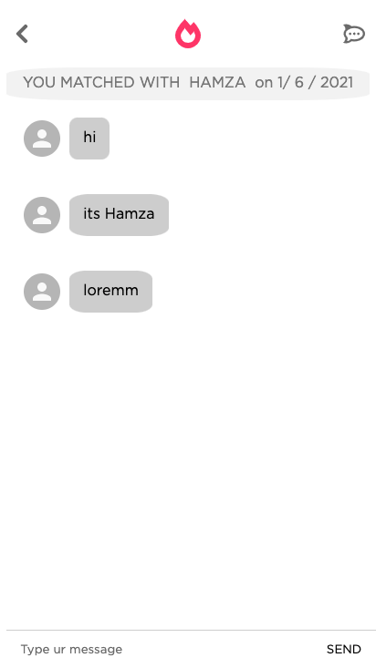

[![Contributors][contributors-shield]][contributors-url]
[![Forks][forks-shield]][forks-url]
[![Stargazers][stars-shield]][stars-url]
[![Issues][issues-shield]][issues-url]
[![MIT License][license-shield]][license-url]
[![LinkedIn][linkedin-shield]][linkedin-url]

<!-- PROJECT LOGO -->
<br />
<p align="center">
  <a href="https://github.com/github_username/repo_name">
    
  </a>

  <h2 align="center">Social Network</h2>

  <p align="center">
    Our own tinder clone
    <br />
    <a href="https://github.com/hamzadarej/social-network/tree/master/src"><strong>Explore the files »</strong></a>
    <br />
    <br />
    <a href="https://github.com/github_username/repo_name">View Demo</a>
    ·
    <a href="https://github.com/github_username/repo_name/issues">Report Bug</a>
    ·
    <a href="https://github.com/github_username/repo_name/issues">Request Feature</a>
  </p>
</p>

<!-- TABLE OF CONTENTS -->
<details open="open">
  <summary><h2 style="display: inline-block">Table of Contents</h2></summary>
  <ol>
    <li>
      <a href="#about-the-project">About The Project</a>
      <ul>
        <li><a href="#built-with">Built With</a></li>
      </ul>
    </li>
    <li>
      <a href="#getting-started">Getting Started</a>
      <ul>
        <li><a href="#prerequisites">Prerequisites</a></li>
        <li><a href="#installation">Installation</a></li>
      </ul>
    </li>
    <li><a href="#usage">Usage</a></li>
    <li><a href="#roadmap">Roadmap</a></li>
    <li><a href="#contributing">Contributing</a></li>
    <li><a href="#license">License</a></li>
    <li><a href="#contact">Contact</a></li>
    <li><a href="#acknowledgements">Acknowledgements</a></li>
  </ol>
</details>

<!-- ABOUT THE PROJECT -->

## About The Project

This is a group project. Our idea was to build a clone of the famous dating application Tinder. Having just finished our first weeks of learning React, we wanted to put our coding muscles to test and apply all we had learned. We are aware of it's overall simplicity, but we would like to share that we had lot's of fun doing it. We also plan to keep adding feature in the future, so please keep tune for further updates and changes.

### Built With

- [React](https://reactjs.org/)
- [Sass](https://sass-lang.com/)
- [React-Icons](https://react-icons.github.io/react-icons)
- [Material-UI](https://material-ui.com/)
- [React-Tinder-Card](https://github.com/3DJakob/react-tinder-card)
- [Unsplash](https://unsplash.com/)

<!-- GETTING STARTED -->

## Getting Started

To get a local copy up and running follow these simple steps.

### Prerequisites

You need to make sure you machine has NPM installed and up to date.

- npm
  ```sh
  npm install
  ```

### Installation

1. Clone the repo
   ```sh
   git clone https://github.com/hamzadarej/social-network.git <your directory name>
   ```
2. Move in the cloned repository
   ```sh
   cd <your directory name>
   ```
3. Download NPM packages
   ```sh
   3.1 npm install node-sass
   3.2 npm install react-router-dom
   3.3 npm install react-tinder-card
   3.4 npm install @material-ui/core
   3§.5 npm install react-icons
   ```
4. Run the application
   ```sh
   npm start
   ```

<!-- USAGE EXAMPLES -->

## Usage

<p align="center">
    

<h2 align="center">Wecome page</h2>
First you be will be greated by our welcome page: After carefull reading the instructions you can log into the application and start using it 😀 </p>
<hr>
<p align="center">
    

<h2 align="center">Cards page</h2>
This is where you will find information about other users and potential dates. We hope that you enjoy the swipe gestures, the overall design and layout of this page. Happy dating 🔥  </p>
<hr>
<p align="center">
    

  
<h2 align="center">Chat and messages page</h2>
After selecting people that you might have insterest in further interacting with this pages will have find more about each other and discover if you are a match. Be always polite and have fun talking to your crushes 😉 </p>
<hr>
<p align="center">
    

<h2 align="center">User profile page</h2>
In this page you will share information about yourself and make sure people can have a glimpse of how awesome you are 😎  </p>

<!-- ROADMAP -->

## Roadmap

We would be thrilled to have you following us along the process to make this application even better. We would like to let you know that we have some changes coming up, as we learn more about backend and database. Some of the features to be included:

- Log in athentication
- Functionality for the "edit info" button in the user profile page
- Real time messaging
- Dark theme

<!-- CONTRIBUTING -->

## Contributing

Contributions are what make the open source community such an amazing place to be learn, inspire, and create. Any contributions you make are **greatly appreciated**.

1. Fork the Project
2. Create your Feature Branch (`git checkout -b feature/AmazingFeature`)
3. Commit your Changes (`git commit -m 'Add some AmazingFeature'`)
4. Push to the Branch (`git push origin feature/AmazingFeature`)
5. Open a Pull Request

<!-- LICENSE -->

## License

Distributed under the MIT License. See `LICENSE` for more information.

<!-- CONTACT -->

## Contact

Hamza Darej - [github page](https://github.com/hamzadarej) - darejhamza@gmail.com
Ruben Sinsig - [github page](https://github.com/rubenSinzig) - email
Angelos Palaiologos - [github page](https://github.com/AngelosPa) - mrpalaiologos@gmail.com
Sergio Oliveira - [github page](https://github.com/thesergioliveira) - thesergioliveira@gmail.com

<!-- ACKNOWLEDGEMENTS -->

## Acknowledgements

- [Hadi Nsreeny](https://github.com/hnsreeny), our amazing web dev teacher and mentor.
- [Tareq](https://github.com/tareq-almasri), we appreciated all the assistance along the way.

<!-- MARKDOWN LINKS & IMAGES -->
<!-- https://www.markdownguide.org/basic-syntax/#reference-style-links -->

[contributors-shield]: https://img.shields.io/github/contributors/hamzadarej/social-network?style=for-the-badge
[contributors-url]: https://github.com/github_username/repo/graphs/contributors
[forks-shield]: https://img.shields.io/github/forks/github_username/repo.svg?style=for-the-badge
[forks-url]: https://github.com/github_username/repo/network/members
[stars-shield]: https://img.shields.io/github/stars/github_username/repo.svg?style=for-the-badge
[stars-url]: https://github.com/github_username/repo/stargazers
[issues-shield]: https://img.shields.io/github/issues/github_username/repo.svg?style=for-the-badge
[issues-url]: https://github.com/github_username/repo/issues
[license-shield]: https://img.shields.io/github/license/github_username/repo.svg?style=for-the-badge
[license-url]: https://github.com/github_username/repo/blob/master/LICENSE.txt
[linkedin-shield]: https://img.shields.io/badge/-LinkedIn-black.svg?style=for-the-badge&logo=linkedin&colorB=555
[linkedin-url]: https://linkedin.com/in/github_username
